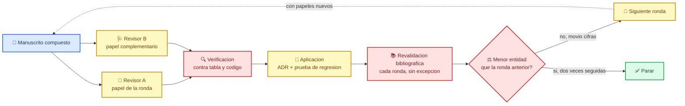

# Bucle de revisión por pares: seis rondas con miradas rotadas

> Documento de encargo para un agente con contexto limpio que va a someter el
> artículo a rondas sucesivas de revisión. Complementa a
> [`05-encargo-de-continuacion.md`](05-encargo-de-continuacion.md), que describe
> el ciclo general de trabajo. Este describe solo el bucle de revisión, y lo
> hace con una exigencia que el otro no tiene: la validación bibliográfica y la
> búsqueda profunda se repiten en cada ronda, no cada dos.
>
> Fecha de corte: 7 de agosto de 2026. Seis rondas internas completadas, 207
> pruebas de regresión en verde, 13 registros de decisión.

---

## 🎯 Por qué existe este documento

Quien escribió el manuscrito es el peor situado para revisarlo. Conoce cada
decisión, recuerda por qué la tomó, y esa memoria funciona como una defensa
automática frente a la objeción. Un agente con contexto limpio no tiene esa
defensa, y es la única razón por la que este bucle produce hallazgos.

La observación empírica del proyecto es que el rendimiento de una ronda depende
casi por completo del formato del encargo. Pedir una revisión genérica devuelve
generalidades inservibles. Pedir a dos revisores con papeles distintos que
verifiquen contra el código una lista explícita de lo que el autor afirma haber
corregido produjo la práctica totalidad de los hallazgos de las seis rondas
anteriores. El formato es la variable que importa.

---

## 📊 El estado que vas a atacar

| Cantidad | Valor |
| --- | --- |
| Palabras del manuscrito, sin referencias | 9.046 |
| Palabras del resumen | 558, contra un límite de 250 a 350 |
| Cifras exportadas desde los modelos | 463 |
| Tablas de resultados | 83 |
| Figuras | 26 |
| Referencias verificadas en el archivo | 166 |
| Referencias efectivamente citadas | 48 |
| Guiones de análisis | 17 |
| Registros de decisión | 13 |
| Pruebas de regresión del artículo | 207, cero fallos |
| Pruebas de la tesis, que no debe moverse | 57, cero fallos |

Las afirmaciones que sostienen el artículo, cada una con la tabla que la
produce, para que las verifiques y no las creas:

| Afirmación | Cifra | Tabla |
| --- | --- | --- |
| El panel cruzado clásico fabrica bidireccionalidad | p = 0,004 y 0,008 | `t01_direccionalidad_sem.csv` |
| Con interceptos aleatorios libres no aguanta ninguna dirección | 0 y 1 de 5 olas | `t01_sem_libre_resumen.csv` |
| Queda covariación estable entre personas | r = 0,152, ajustada 0,171 | `t01_correlacion_rasgo_libre.csv` |
| Marca nivel, no pendiente | +1,396 frente a p = 0,189 | `t04_mixto.csv` |
| No es dopaminérgica | dolor p = 0,766, motor p < 0,001 | `t11_h2_dat.csv` |
| No es específica del dolor | cinco análisis convergentes | varias |
| El estilo de reporte no explica lo explorado | atenúa 77 % la Parte II, 0 % la Parte III | `t15_dos_desenlaces.csv` |
| Liberar la pendiente no cambia la conclusión | 0,175 a 0,189 | `t16_pendiente_comparacion.csv` |

---

## 🔁 El bucle, y por qué se rotan los papeles

_Diagrama del ciclo de una ronda. Cada ronda entra por la izquierda con el
manuscrito compuesto y sale por la derecha con una decisión de continuar o
parar._



Los papeles rotan porque un revisor estadístico encuentra en la ronda 3 lo
mismo que encontró en la ronda 1. La rotación es el mecanismo que fuerza el
contexto nuevo a mirar sitios nuevos.

| Ronda | Revisor A | Revisor B |
| --- | --- | --- |
| 1 | Inferencia causal y modelos de ecuaciones estructurales | Trastornos del movimiento y dolor en Parkinson |
| 2 | Bibliografía y atribución de fuentes | Reproducibilidad e integridad del código |
| 3 | Editor de revista objetivo, decidiendo rechazo o revisión | Estadístico bayesiano o frecuentista contrario al enfoque usado |
| 4 | Medida y psicometría, fiabilidad y varianza de método | Epidemiología de cohortes, atrición y selección |
| 5 | Lector clínico escéptico que solo lee resumen, figuras y conclusiones | Revisor de datos que solo mira tablas y no lee prosa |
| 6 | Adversario declarado, con el encargo de tumbar el artículo | Sintetizador, que decide qué sobrevive de todo lo anterior |

---

## 🧰 Skills, y cuándo usarlas

| Skill | Cuándo |
| --- | --- |
| `/peer-review` | Para redactar cada informe de revisión |
| `/scientific-critical-thinking` | Al evaluar si una afirmación aguanta |
| `/literature-review` | Cada ronda, antes de afirmar que algo es novedoso o que falta |
| `/deep-research` | Cada ronda, para las preguntas que necesiten varias fuentes cruzadas |
| `/paper-lookup` | Para recuperar y verificar cada referencia por PMID o DOI |
| `/verify-claims` | Sobre toda afirmación que no venga de una tabla |
| `/clinical-numbers-audit` | Antes de dar por buena cualquier tanda de cifras |
| `/statistical-analysis` | Antes de elegir un contraste nuevo |
| `/figure-qa` | Obligatorio tras generar cualquier figura |
| `/critique-figures` | Antes de dar una figura por buena |
| `/scientific-visualization` | Si hay que rehacer una figura desde cero |
| `/markdown-mermaid-writing` | Para cualquier diagrama nuevo |
| `/latex` | Para las versiones tipográficas en TikZ |
| `/architecture-decision-records` | Para cada decisión que cambie un resultado |
| `/the-humanizer` | Antes de cerrar cualquier bloque de prosa nueva |

---

## 📚 La exigencia bibliográfica, que es la parte no negociable

En cada ronda, no cada dos, se repite el ciclo completo sobre las 48
referencias citadas:

1. Recupera el registro real por PMID o DOI contra PubMed o Crossref. No basta
   con que la clave exista en `manuscript/referencias.json`.
2. Comprueba que la afirmación del manuscrito es lo que el trabajo dice, no lo
   que su título sugiere. Este es el paso que falla.
3. Marca toda cita donde el manuscrito extienda, suavice o invierta lo que la
   fuente sostiene.

El proyecto ha encontrado tres citas que atribuían a un trabajo algo que no
contenía, y las tres sobrevivieron a varias rondas de revisión antes de caer.
Una de ellas afirmaba que un estudio no había encontrado asociación con el
dolor cuando ese estudio nunca midió dolor. Asume que queda alguna.

Y en cada ronda, la búsqueda de lo que falta, con al menos tres formulaciones
distintas antes de concluir que algo no existe:

- ¿Existe algún trabajo que ya haya hecho esto y no esté citado? El manuscrito
  afirma que no hay análisis previo de panel cruzado con interceptos aleatorios
  sobre dolor y función motora en Parkinson. Intenta refutarlo.
- ¿Hay literatura que contradiga el hallazgo central y no aparezca?
- ¿Hay trabajos de 2025 y 2026 que cambien el contexto?

---

## ⚠️ Los cuatro patrones de error del proyecto

No repitas el trabajo de corregirlos, pero busca ejemplares nuevos de cada uno,
porque los cuatro han reaparecido.

| Patrón | Ejemplares ya encontrados |
| --- | --- |
| Cita que atribuye a una fuente algo que no contiene | Liu 2020 citado por un resultado sobre dolor que nunca midió; VanderWeele 2019 por una distinción de escala que no menciona; Pautrat 2023 por una afirmación sobre estadios de Braak que contradice |
| El texto no sigue al código | Dos valores p intercambiados que invertían el argumento; una correlación atribuida a la variable equivocada; un marcador de plantilla imprimiendo la cifra de otra variable; Métodos afirmando un conjunto de ajuste que los modelos no llevan |
| El código no hace lo que su propio comentario dice | El comentario declara primario el modelo libre y el guion extrae solo del restringido; una regla preespecificada evaluada y luego incumplida; etiquetas escalares en lavaan imponiendo igualdad entre grupos sin avisar |
| Una cifra que depende de la parametrización y no de los datos | El efecto de nivel del modelo mixto era la sección transversal basal por no centrar el tiempo; la correlación de rasgo de la curva latente sube de 0,189 a 0,242 con las cargas sin centrar y el mismo ajuste. Las dos veces el error produjo la cifra conveniente |

El cuarto patrón es el más reciente y el más instructivo. Las dos veces se
detectó por desconfiar de un resultado que gustaba, no revisando código. Si en
alguna ronda encuentras una cifra que refuerza el artículo, ese es el momento
de aplicar más escrutinio, no menos.

---

## 🚫 Lo que NO es factible, para que no se pierda tiempo

- Neuropatía de fibra fina. PPMI no tiene biopsia, prueba sensorial cuantitativa
  ni electroneurografía.
- Subtipos de dolor. Haría falta la KPPS o la PD-PCS; PPMI tiene un ítem.
- Conectómica de estimulación subtalámica. No hay pacientes operados con imagen
  en esta muestra; sería otro estudio.
- Aumentar la potencia del contraste con controles sanos. Son 307 y no hay más.
- Separar ausencia real de acoplamiento intrapersonal de falta de señal. La
  fiabilidad del ítem de dolor es 0,392 y el manuscrito ya declara que no puede
  distinguirlas.

---

## 🛑 Cuándo parar

Para cuando se cumpla cualquiera de estas, y no antes:

- dos rondas consecutivas sin ningún hallazgo que cambie una cifra
- lo que queda exige datos que PPMI no tiene
- lo que queda exige una decisión del autor y no del analista, como la revista
  objetivo, el orden de autoría o el alcance

No pares porque las pruebas estén en verde. Las pruebas comprueban que nada se
movió, no que nada esté mal.

Después de cada ronda responde por escrito a una sola pregunta: ¿lo que encontró
esta ronda es de menor entidad que lo de la anterior? Si la respuesta es sí dos
veces seguidas, para y dilo. Un informe que no encuentra nada es un resultado
legítimo; un informe que inventa problemas para parecer riguroso hace perder el
tiempo y erosiona la confianza en todo lo demás.

---

## 🔧 Reproducir

```bash
export PPMI_RAW_DIR=/ruta/a/los/csv/de/ppmi
make prep-paper   # fenotipo, cohortes, biomarcadores, analgésicos
make paper        # 16 análisis, figuras, cifras, manuscrito, pruebas
Rscript tests/test_paper.R        # 207 pruebas del artículo
Rscript tests/test_resultados.R   # 57 de la tesis, que NO debe moverse
```

Si `data/tidy_long.csv` deja de reproducir byte a byte, algo se ha roto. La
tesis transversal está cerrada y su pipeline es el control de integridad del
proyecto entero.
