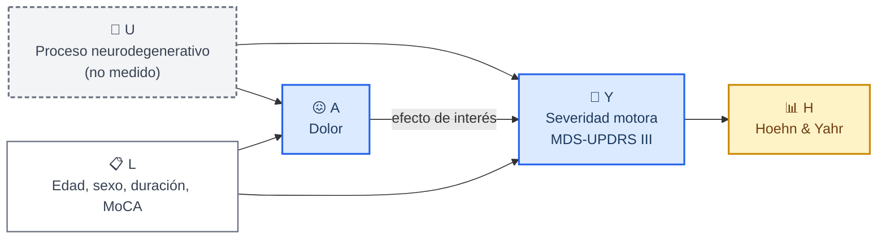
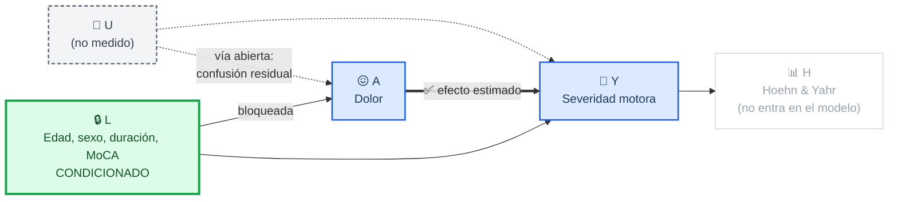
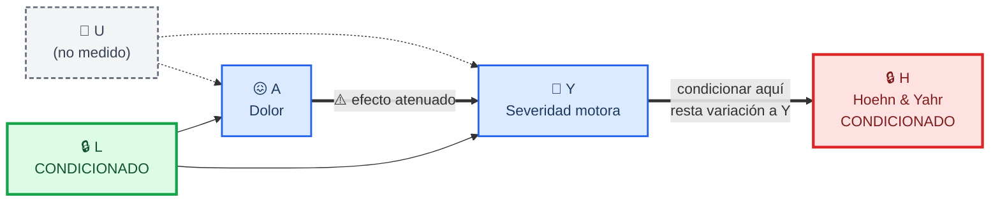
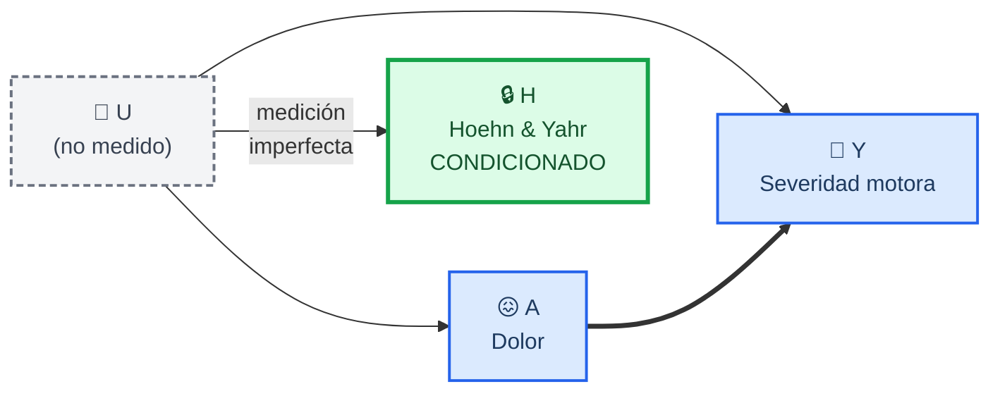
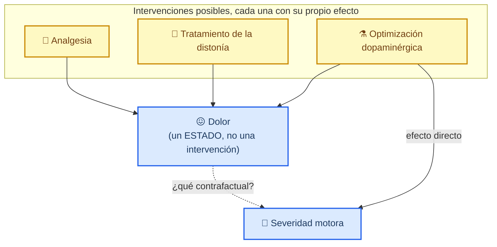

# DAGs causales de los modelos de la tesis

Este documento hace explícitas las suposiciones causales de cada modelo. Sigue la
convención de Hernán y Robins: un **recuadro** alrededor de una variable significa
que el análisis **condiciona** sobre ella.[^1]

La razón de escribirlos es que la conclusión del estudio cambia según se ajuste o
no por el estadio de Hoehn & Yahr, y esa decisión no puede tomarse mirando los
datos: dadas tres variables sin independencias, la distribución conjunta es
compatible con varios grafos, de modo que **hay que apoyarse en información
externa**.[^1] Dibujar los grafos es la forma de poner esa información sobre la
mesa para que pueda discutirse.

---

## 📐 Notación

| Símbolo | Significado |
| --- | --- |
| `A` | Exposición: dolor (MDS-UPDRS I, ítem 1.9) |
| `Y` | Desenlace: severidad motora (MDS-UPDRS III) |
| `L` | Covariables medidas: edad, sexo, duración de la enfermedad, MoCA |
| `H` | Estadio de Hoehn & Yahr |
| `U` | Variable **no medida** |
| Recuadro doble | El análisis **condiciona** sobre esa variable |

---

## 🧭 DAG 1: la estructura que sostiene la literatura mecanística

_El grafo de partida. `U` representa el proceso neurodegenerativo latente: pérdida
de ganancia en la puerta sensorial de los ganglios basales, denervación
dopaminérgica y degeneración de vías moduladoras no dopaminérgicas. Ese proceso
causa a la vez el dolor y el deterioro motor. Además existe un efecto directo del
dolor sobre el desempeño motor, por sobrecarga musculoesquelética y por umbral
nociceptivo reducido._

El punto decisivo es la flecha `Y --> H`. El estadio de Hoehn & Yahr clasifica la
enfermedad por lateralidad de la afectación, compromiso axial e inestabilidad
postural: **es una medición gruesa de la misma función motora que constituye el
desenlace**, no una causa separada de él.

---

## ✅ DAG 2: el modelo primario, que ajusta por `L` y no por `H`

_Condicionar sobre `L` bloquea la vía de puerta trasera `A ← L → Y`. La vía
`A ← U → Y` queda abierta, porque `U` no se mide: es confusión residual y se
declara como limitación. El efecto de interés `A → Y` se estima sin bloquearlo._

**Estimando:** el efecto total del dolor sobre la severidad motora, con confusión
residual por `U` no controlada.

---

## ⚠️ DAG 3: el modelo secundario, que ajusta además por `H`

_Ésta es la especificación registrada en el protocolo. Condicionar sobre `H`, que
es un descendiente de `Y`, bloquea parte de la variación del desenlace y sesga el
coeficiente de `A` hacia el nulo. Es el escenario que Hernán y Robins describen
como sobreajuste.[^1][^2]_

**Estimando:** un efecto neto del estadio de la enfermedad, no el efecto total. Es
una cantidad legítima, pero **no es la que plantea el objetivo del estudio**.

---

## 🔄 DAG 4: la lectura alternativa, con `H` como confusor sustituto

_Los datos no permiten descartar esta estructura, y la honestidad obliga a
dibujarla. Si `H` fuera una medición imperfecta de `U` en lugar de un descendiente
de `Y`, condicionar sobre él bloquearía parcialmente la vía de puerta trasera y el
ajuste sería correcto, aunque incompleto, porque la medición es imperfecta y
quedaría confusión residual.[^1]_

**Bajo esta lectura**, el ajuste por `H` reduce la confusión sin eliminarla. Pero
obsérvese que aun así el modelo ajustado **no** estimaría el efecto total limpio:
la correlación observada entre estadio y desenlace (ρ = 0,559) es demasiado baja
para que el ajuste controle `U` por completo.

---

## ⚖️ Cómo decidir entre el DAG 3 y el DAG 4

Ninguna prueba estadística lo resuelve. La información externa disponible es:

| Argumento | Favorece |
| --- | --- |
| El Hoehn & Yahr clasifica lateralidad, compromiso axial e inestabilidad postural: mide función motora por construcción[^3] | DAG 3 (sobreajuste) |
| Es el único término que incumple individualmente el supuesto de odds proporcionales (p = 0,006), es decir, no se comporta como covariable ordinaria | DAG 3 |
| ρ de Spearman con el desenlace = 0,559: sustancial, pero no equivalencia | Ambos |
| El estadio sí captura progresión de la enfermedad, que es un confusor real | DAG 4 |

Se adopta el **DAG 2 como modelo primario** y se reporta el DAG 3 como secundario,
con las doce especificaciones en la Tabla 3 y la Figura 4 para que el lector pueda
juzgar por sí mismo. Dirimir la cuestión de forma concluyente exige el orden
temporal entre las tres variables, es decir, un diseño longitudinal, que queda
fuera del alcance de esta tesis, transversal por diseño.

---

## 🧪 Un DAG adicional: la exposición no es una intervención

_Una advertencia de fondo. Hernán y Robins distinguen entre **estados** e
**intervenciones**: preguntar por «el efecto del dolor» presupone un contrafactual
que no está bien definido, igual que ocurre con el índice de masa corporal o la
pobreza.[^4] Intervenir sobre el dolor puede significar cosas muy distintas, y cada
una tendría un efecto diferente sobre la función motora._

Por eso la tesis estima y comunica una **asociación ajustada**, y no un efecto
causal. Toda lectura causal debe hacerse con esa salvedad presente.

---

[^1]: Hernán MA, Robins JM. *Causal Inference: What If*. Boca Raton: Chapman & Hall/CRC; 2020. https://miguelhernan.org/whatifbook
[^2]: Schisterman EF, Cole SR, Platt RW. Overadjustment bias and unnecessary adjustment in epidemiologic studies. *Epidemiology*. 2009;20(4):488-95. https://doi.org/10.1097/EDE.0b013e3181a819a1
[^3]: Hoehn MM, Yahr MD. Parkinsonism: onset, progression and mortality. *Neurology*. 1967;17(5):427-42. https://doi.org/10.1212/wnl.17.5.427
[^4]: Hernán MA, Taubman SL. Does obesity shorten life? The importance of well-defined interventions to answer causal questions. *Int J Obes (Lond)*. 2008;32(Suppl 3):S8-14. https://doi.org/10.1038/ijo.2008.82
