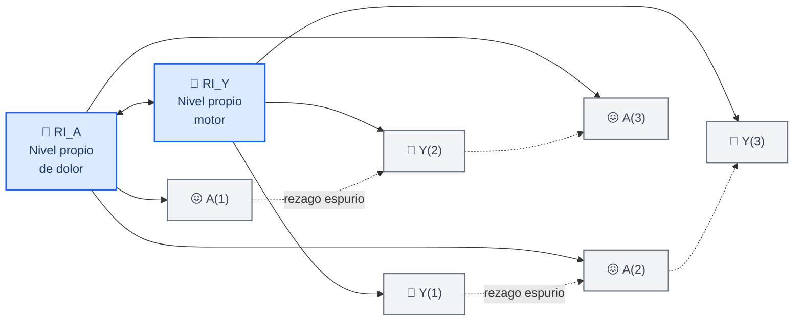
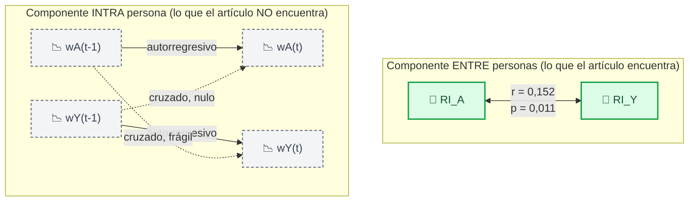
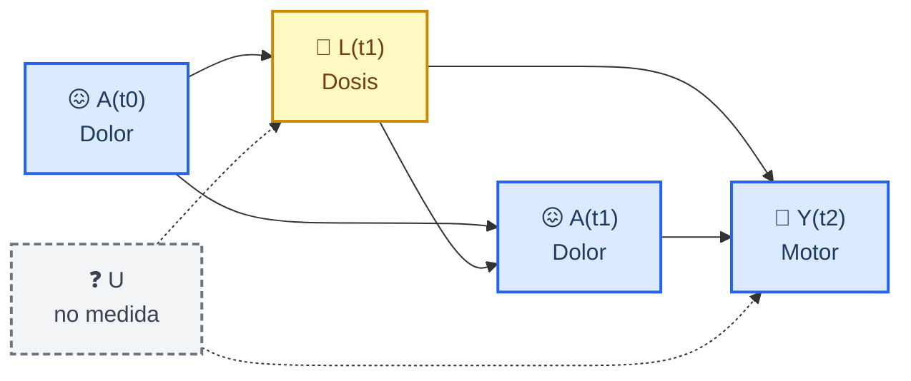
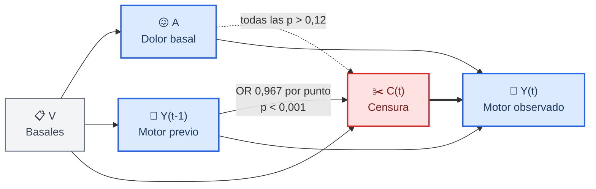
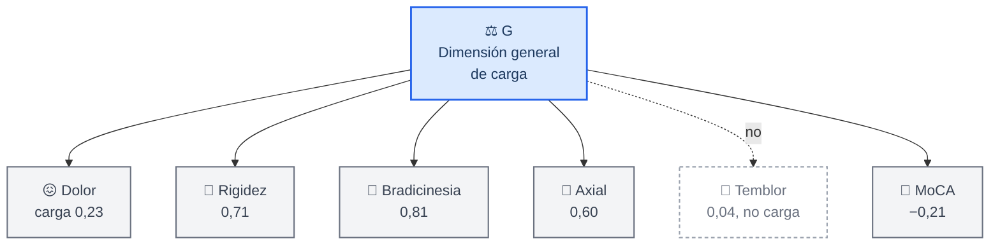

# DAGs causales del artículo longitudinal

Este documento hace explícitas las suposiciones causales de los modelos que la
tesis transversal no podía plantear. Continúa la notación de
[`dags-causales.md`](dags-causales.md) y la convención de Hernán y Robins: un
recuadro alrededor de una variable significa que el análisis condiciona sobre
ella.[^hernan]

La tesis dejó la pregunta abierta porque el dolor, el estadio y la puntuación
motora se miden el mismo día y no hay orden temporal que invocar. Con seis olas
anuales sí lo hay, pero aparecen tres estructuras nuevas que el diseño transversal
no tenía que resolver: la separación entre la variación estable entre personas y
la variación intrapersonal, la censura por atrición, y un confusor variable en el
tiempo afectado por la exposición previa. Cada una tiene su grafo.

---

## 📐 Notación

| Símbolo | Significado |
| --- | --- |
| `A(t)` | Exposición en la visita t: dolor autoinformado (MDS-UPDRS ítem 1.9) |
| `Y(t)` | Desenlace en la visita t: severidad motora (MDS-UPDRS III, estado OFF) |
| `L(t)` | Confusor variable en el tiempo: dosis dopaminérgica equivalente |
| `V` | Covariables basales fijas: edad, sexo, duración de la enfermedad, MoCA |
| `RI` | Intercepto aleatorio: el nivel propio y estable de cada persona |
| `C(t)` | Censura: el paciente deja de acudir a partir de la visita t |
| `U` | Variable no medida |
| Recuadro doble | El análisis condiciona sobre esa variable |

---

## 🔀 DAG 1: por qué el panel cruzado clásico fabrica bidireccionalidad

_Es el grafo que explica el resultado central del artículo. Si cada persona tiene
un nivel propio y estable de dolor y otro de severidad motora, y esos dos niveles
covarían, entonces las observaciones repetidas de una misma persona están todas
desplazadas en la misma dirección. Un modelo que no separa ese desplazamiento lo
lee como si el valor pasado de una serie predijera el valor futuro de la otra,
cuando lo único que ocurre es que ambas series pertenecen a la misma persona._

La flecha discontinua no es un efecto: es lo que el estimador informa cuando no
puede ver los interceptos. En estos datos el modelo clásico da significación en
las dos direcciones, y el que separa los interceptos anula una y deja la otra
frágil, con mejor ajuste.

---

## 🎯 DAG 2: qué estima cada componente una vez separados

_Separar los interceptos parte la pregunta en dos, y las dos son legítimas pero
distintas. La correlación entre `RI_A` y `RI_Y` responde a si las personas con
más dolor son las que tienen más afectación motora. Los rezagos entre las
desviaciones `w` responden a si, cuando a una persona le sube el dolor por encima
de su propio nivel, su puntuación motora sube después. El artículo encuentra lo
primero y no lo segundo._

---

## 💊 DAG 3: la dosis dopaminérgica como confusor afectado por la exposición

_Es el escenario canónico en que la regresión convencional falla en las dos
direcciones. La dosis responde a los síntomas y a su vez afecta a los síntomas
posteriores, de modo que ajustar por ella bloquea parte del efecto y además abre
un camino de colisión si existe una causa común no medida de la dosis y del
desenlace. Ajustar y no ajustar son las dos opciones malas._

> ⚠️ **Lo que este grafo justifica, y lo que no.** La estructura justifica un modelo
> estructural marginal **sólo si la flecha `A(t0) → L(t1)` existe**. En estos datos
> ese coeficiente es de 18,3 mg con intervalo de −2,17 a 38,85 y p = 0,080, es decir,
> no la sostiene. Por la regla preespecificada en el propio código, el modelo
> estructural marginal queda como análisis de sensibilidad y no como principal. Ver
> el [ADR 0010](../adr/0010-atricion-y-confusion-variable-en-el-tiempo.md).

---

## 📉 DAG 4: la censura por atrición

_La retención cae del 97 % en la basal al 20 % a los cinco años. Lo que decide si
eso sesga es de qué depende la censura. Aquí depende del desenlace, no de la
exposición: la severidad motora basal predice el abandono y el dolor basal no lo
predice en ningún horizonte._

Que la censura dependa del desenlace y no de la exposición explica por qué los
pesos por probabilidad inversa de censura quedan próximos a uno y por qué apenas
mueven las estimaciones. Es un resultado, no una formalidad: acota cuánto puede
haber distorsionado la atrición.

---

## 🔍 DAG 5: la estructura de especificidad que el artículo contrasta

_El grafo que hay que descartar antes de atribuir la covariación a algo propio del
dolor. Si existe una dimensión general de carga que causa a la vez el dolor, la
severidad motora y el estado cognitivo, la correlación observada no dice nada
específico sobre el dolor. El artículo contrasta esta estructura de cuatro
maneras, y no consigue descartarla._

Los cuatro contrastes y su veredicto:

| Contraste | Predicción si `G` es la explicación | Resultado |
| --- | --- | --- |
| Liberar la covarianza residual dolor-motor | no mejora el ajuste | no mejora (p = 0,227) |
| Depresión como exposición alternativa | mismo patrón que el dolor | mismo patrón (p = 0,001 en ambos) |
| Cognición como desenlace alternativo | también covaría con el dolor | covaría (r = −0,157) |
| Controles sanos y prodrómicos | correlación similar sin la enfermedad | similar, aunque el contraste no concluye |

Ninguno descarta `G`. El artículo lo declara en lugar de sortearlo.

---

## 🧾 Qué se decide con estos grafos

| Decisión | Grafo que la sostiene | Registro |
| --- | --- | --- |
| El modelo con interceptos aleatorios es el primario | DAG 1 y 2 | [ADR 0006](../adr/0006-resolucion-de-la-discrepancia-direccional.md) |
| El modelo estructural marginal es sensibilidad, no principal | DAG 3 | [ADR 0010](../adr/0010-atricion-y-confusion-variable-en-el-tiempo.md) |
| Se pondera por censura y se reportan las dos versiones | DAG 4 | [ADR 0010](../adr/0010-atricion-y-confusion-variable-en-el-tiempo.md) |
| No se afirma especificidad de la covariación | DAG 5 | [ADR 0011](../adr/0011-el-mecanismo-no-es-dopaminergico-ni-especifico.md) |

---

[^hernan]: Hernán MA, Robins JM. *Causal Inference: What If*. Boca Raton: Chapman & Hall/CRC; 2020. https://miguelhernan.org/whatifbook
